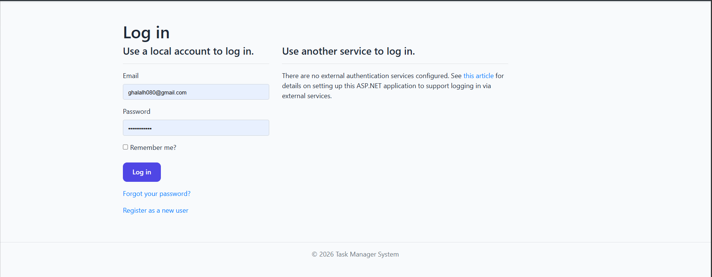
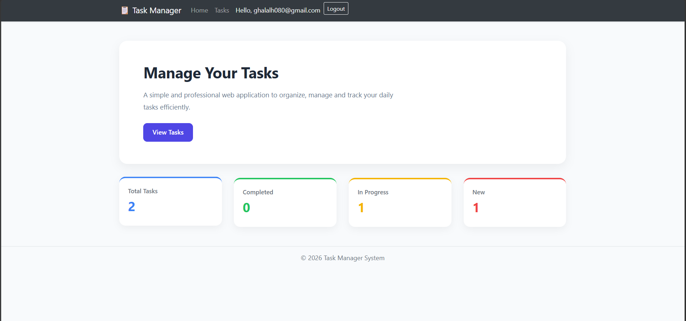
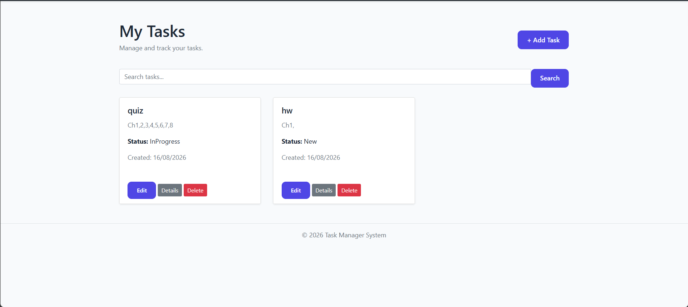
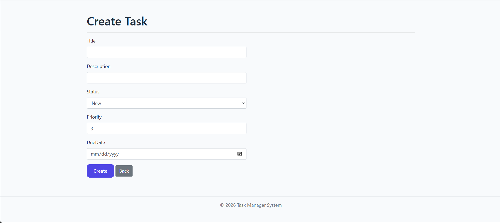
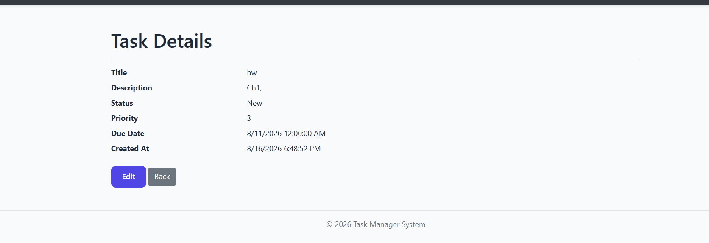

# 📋 Task Management System

> An ASP.NET Core MVC web application for creating, organizing, managing, and tracking daily tasks with a simple and professional interface.


---

# 📖 Project Overview

Task Management System is a web-based application developed using **ASP.NET Core MVC** to help users create, organize, and manage their daily tasks efficiently.

The system allows users to securely log in, create and manage tasks, track task progress, set priorities and due dates, search for tasks, and view detailed task information through an intuitive dashboard.

---

# ✨ Features

* 🔐 User login and authentication
* 🏠 Dashboard with task statistics
* ➕ Create new tasks
* ✏️ Edit existing tasks
* 🗑️ Delete tasks
* 🔍 Search for tasks
* 📋 View all tasks
* 📄 View task details
* 📊 Track task status
* ⭐ Set task priority
* 📅 Set task due dates
* 📈 Monitor task progress
* 📱 Responsive Bootstrap interface

---

# 🛠️ Technologies

* ASP.NET Core MVC
* C#
* Entity Framework Core
* SQL Server
* HTML5
* CSS3
* Bootstrap
* Razor Views
* Visual Studio

---

# 📂 Project Structure

```text
Task-Management-System
│
├── TaskManager
│   ├── Controllers
│   ├── Models
│   ├── Views
│   ├── Data
│   └── wwwroot
│
├── image
│   ├── login.png
│   ├── home.png
│   ├── tasks.png
│   ├── create-task.png
│   └── task-details.png
│
├── .gitignore
├── TaskManager.sln
└── README.md
```

---

# 🖼️ Application Preview

## 🔐 Login Page

The Login page allows users to securely access the Task Management System.



---

## 🏠 Dashboard

The dashboard provides an overview of the user's tasks and displays task statistics based on their current status.



---

## 📋 My Tasks

The My Tasks page allows users to view, search, edit, view details, and delete their tasks.



---

## ➕ Create Task

The Create Task page allows users to create a new task by entering the task title, description, status, priority, and due date.



---

## 📄 Task Details

The Task Details page displays complete information about a selected task, including its title, description, status, priority, due date, and creation date.



---

# 🗄️ Database

The project uses **Microsoft SQL Server** as the backend database.

**Entity Framework Core** is used to manage database operations and provide communication between the application and the SQL Server database.

The database contains the required data for managing users and tasks, including task status, priority, due dates, and other task information.

---

# 🚀 Installation

### 1. Clone the repository

```bash
git clone https://github.com/Ghala77-prog/Task-Management-System.git
```

### 2. Open the project

Open the solution file:

```text
TaskManager.sln
```

using **Visual Studio**.

### 3. Configure the database

Update the SQL Server connection string in:

```text
appsettings.json
```

Make sure the connection string matches your local SQL Server configuration.

### 4. Restore NuGet Packages

Open the project in Visual Studio and restore all required NuGet packages.

### 5. Apply Entity Framework Core migrations

If migrations are included in the project, run:

```bash
Update-Database
```

or use the Package Manager Console in Visual Studio.

### 6. Run the application

Press:

```text
F5
```

or use **Ctrl + F5** to run the application.

---

# 💡 Project Highlights

* ASP.NET Core MVC Architecture
* Entity Framework Core integration
* SQL Server database
* CRUD operations
* User authentication
* Task management
* Task search functionality
* Task status tracking
* Priority management
* Due date management
* Dashboard statistics
* Responsive user interface

---

# 🎯 Project Purpose

This project was developed to demonstrate practical experience in building a complete web application using **ASP.NET Core MVC**, including database integration, authentication, CRUD operations, MVC architecture, and responsive UI development.

---

# 👩🏻‍💻 Author

**Ghala Alharbi**

Data Science Graduate

GitHub:

https://github.com/Ghala77-prog

---

⭐ Feel free to explore the project and provide your feedback.
